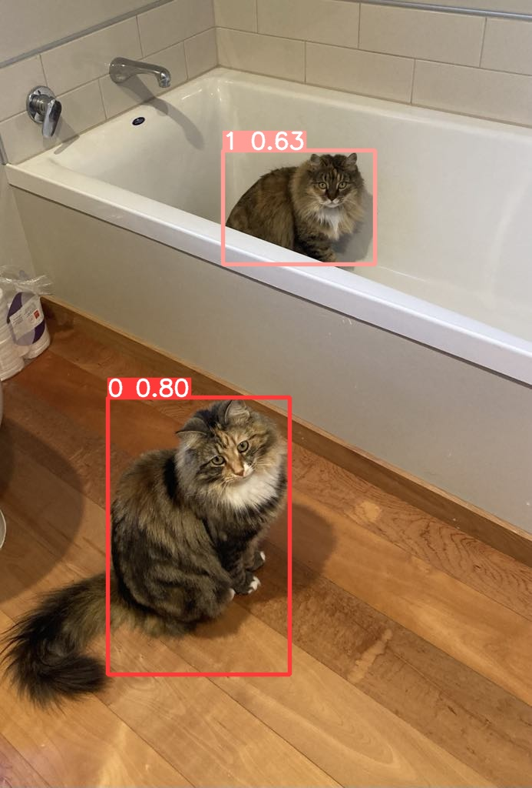

# Cats, Camera, Action

## About
This project aims to detect different cats apart from each other using YOLOv8. An example of this can be seen below. 




## Included
This folder includes:
- Training
- Augmentation (Exposure and saturation)
- Uploading data to Roboflow
- Using trained model for prediction
- Confusion matrices (somewhat a manual process)


## How to use
1) Upload all data to [Roboflow](https://app.roboflow.com/) and add classes to that match your cats names.
2) Use Roboflows' automatic annotation tool detect all instances of a "cat" class.
3) Mannaly go through all the bounding boxes places by Roboflow and ensure they are correct. Then assign each bounding box to one your classes made.
4) Download the data into your local machine
5) Adjust the augmentation code to apply what augmentations you would like done on the data. This can be done running 
```bash
 python augmentation.py 
```
6) Adjust the code in *upload_data.py* to match your Roboflow project and *label_map.labels* to match your own classes. Run: 
```bash
 python upload_data.py 
```
7) Train the data on [Google-Colab](https://colab.google/) using this [Notebook](https://colab.research.google.com/drive/1BfJg6bqzenXWSVGYTY4vzwNYMTSbbV5Q?usp=sharing). Make any adjustments to the Roboflow project, workspace, API key and output file name.
8) Download the zip folder on Google Colab
9) Place any the weights in the *weights.pt* files in your downloaded file into the *models* folder.
10) Place all images you like to test your model against in the *test_images* folder.
11) Run the below to see how well your model works
```bash
 python validate.py 
```

## Notes
Skeleton code also exists if wanting to train YOLOv8 on your local machine. Note that this often much slower than using Google Colab.

Enjoy!